## 💜 롤링 페이퍼 웹사이트 만들기 💜

 

  
프로젝트 개발 기간: 2024.02.26 - 2024.03.11

## 📚목차

- 배포주소
- 프로젝트에 대한 소개
- 사용한 기술 스택
- 주요 기능
- 서비스 구성
- 팀 소개

## 💾 배포 주소

https://naver.com
  

## 🎀프로젝트에 대한 소개

추억의 롤링 페이퍼를 웹 상에서도 즐길 수 있는 플랫폼인 '롤링'이라는 웹앱 서비스입니다.

코드잇 프론트 엔드 4기에서 진행이 된 첫 프로젝트로, 주어진 피그마 디자인과 api에 맞추어서 웹 개발을 진행 하였습니다. 정해진 기능을 개발하며 사용자 경험을 중요하게 생각하여 필요하다고 생각되는 기능을 추가하여 개발을 진행 하였습니다.

  

## 🏝 사용한 기술 스택

|                                                                                                       tools                                                                                                        |                                                                                                                                                                                                                                                                                  FlatForms & Language                                                                                                                                                                                                                                                                                   |
| :----------------------------------------------------------------------------------------------------------------------------------------------------------------------------------------------------------------: | :-------------------------------------------------------------------------------------------------------------------------------------------------------------------------------------------------------------------------------------------------------------------------------------------------------------------------------------------------------------------------------------------------------------------------------------------------------------------------------------------------------------------------------------------------------------------------------------: |
|   |       |

 

## 📲 주요 기능

- 롤링 페이퍼 게시 기능: 사용자는 자신의 롤링 페이퍼를 원하는 폰트와 배경을 선택하여 생성하고 웹에 게시할 수 있습니다.

- 롤링 페이퍼 수정 기능: 사용자는 자신의 롤링 페이퍼를 삭제 또는 수정 할 수 있습니다.

- 롤링 페이퍼 확인 기능: 롤링 페이퍼들을 한 페이지에서 쉽게 확인 할 수 있습니다. 또한 사용자의 흐름이 끊기지 않도록 무한 스크롤을 적용하였습니다

- 이모지 반응 기능: 사용자는 다른 사용자들의 롤링 페이퍼에 이모지로 반응을 추가 또는 삭제할 수 있습니다.

- 소셜 공유 기능: 카카오톡과 URL 복사를 통해 롤링 페이퍼를 쉽게 공유할 수 있습니다.

  

## 전반적인 서비스 구성

### Landing Page (주소: /)

- 페이지에 접속하게 되면 처음 보이는 랜딩 페이지입니다.
  전반석인 서비스에 대한 설명이 되어있고 구경 해보기 버튼을 누르게 되면 롤링페이퍼를 생성할 수 있는 생성 페이지로 이동합니다.

  

### List Page (주소: /list)

- 주요 기능: 특정 사람에게 몇 명이 적었고, 어떤 이모지를 사용했는지를 한눈에 확인할 수 있습니다. 전반적인 롤링 페이퍼 리스트들을 인기순, 최신순으로 나누어 확인 할 수 있습니다.
- 인기순은 이모지의 전체 개수를 기준으로 정렬되었고 최신순은 사용자가 롤링페이퍼를 생성한 시간을 기준으로 정렬되었습니다.
    
  
    
- 전체 보기 버튼을 눌러 인기 롤링 페이퍼, 최근에 만든 롤링 페이퍼 각각을 한눈에 볼 수 있습니다. 또한 사용자 경험을 고려한 무한 스크롤이 구현 되어있습니다.
    
  
    

### Edit Page (주소: /post/{id})

- 주요 기능: 특정 사람에게 작성한 다른 사람들의 롤링페이퍼를 볼 수 있습니다. 각 리스트를 누르면 모달 창이 뜨며, 전문을 확인 할 수 있습니다.
- 편집 모드: 편집 버튼을 통해 롤링페이퍼 대상 혹은 롤링페이퍼 메세지를 삭제할 수 있습니다. 삭제를 원할 경우 경고창을 통해 삭제할 것인지에 대한 여부를 다시 한번 물어 실수로 삭제되는 경우를 방지하였습니다.
    
  
    
- 롤링페이퍼 메세지는 무한 스크롤로 구현하였습니다.
    
  
  

### Post Page (주소: /post, /post/{id}/message)

- 보내고 싶은 사람의 이름, 페이지 배경, 색상을 선택해 대상을 등록할 수 있습니다.   
  
- 대상과의 관계와 이름, 프로필 사진, 폰트를 설정하여 그 대상에게 직접 롤링페이퍼를 작성할 수 있습니다.
    
  

### Header

- 메인헤더와 서브헤더로 나누었습니다.  
  메인 헤더는 로고와 롤링 페이퍼 만들기 버튼을 이용할 수 있습니다. 
    
  서브 헤더는 누구에게 몇 명이 보냈는지 간략하게 알 수 있습니다. 또한 자신이 추가하고 싶은 이모지를 선택하여 추가 할 수 있고, 공유 버튼으로 카카오톡 공유나, URL을 복사할 수 있습니다. 
  

### 반응형 (Tablet)

| 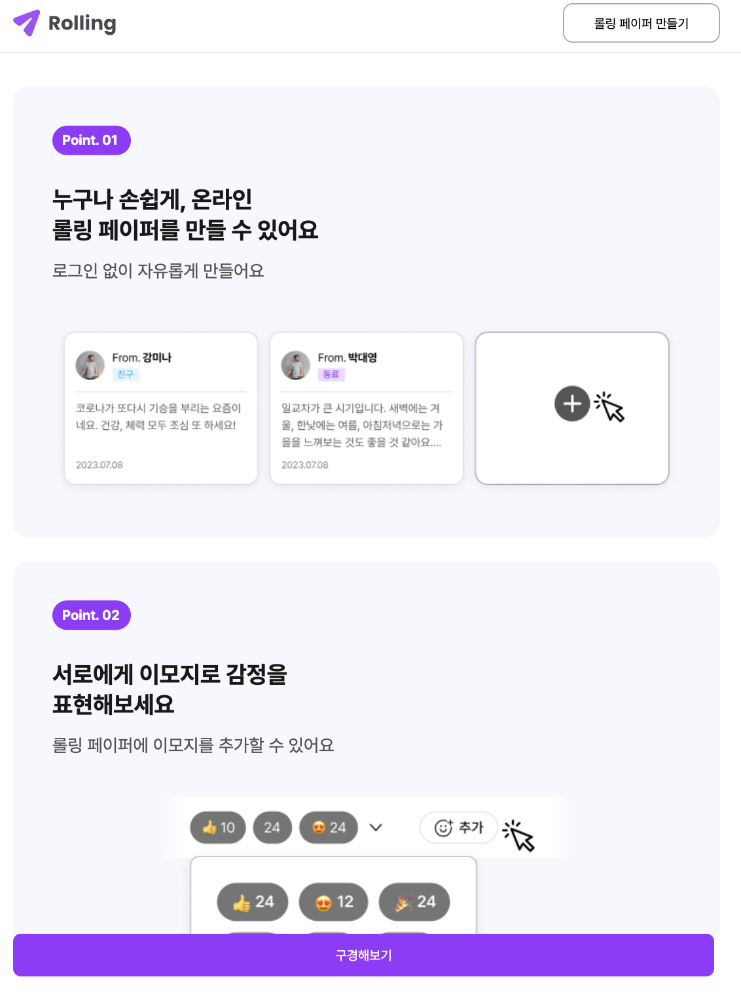 | 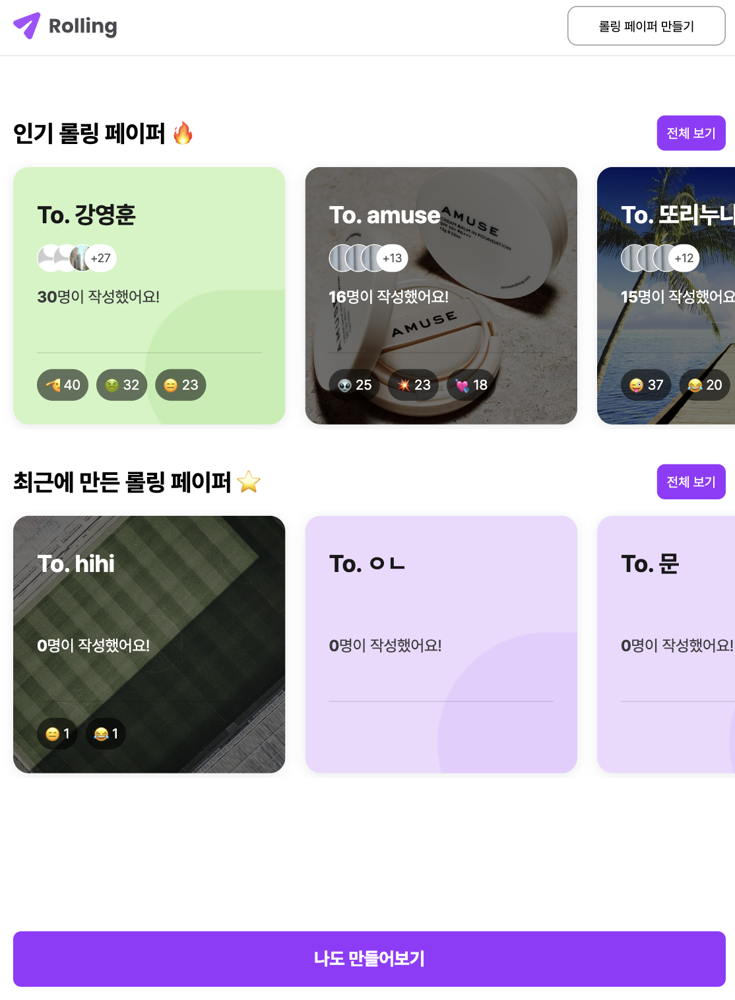 |
| ------------------------------------------- | ------------------------------------- |
| 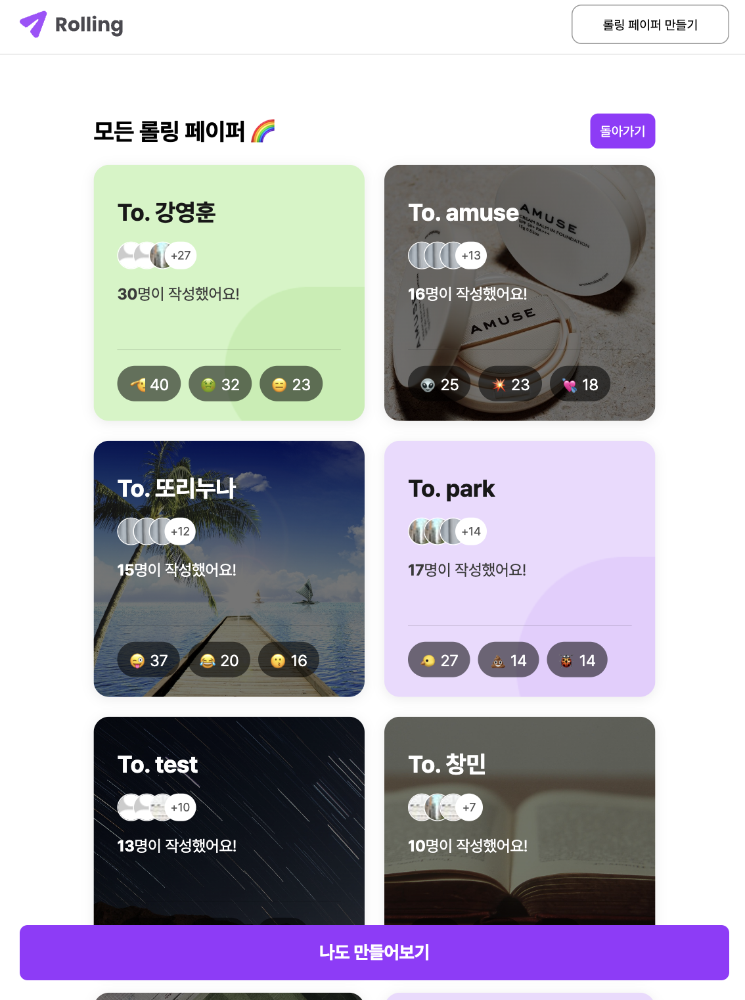     | 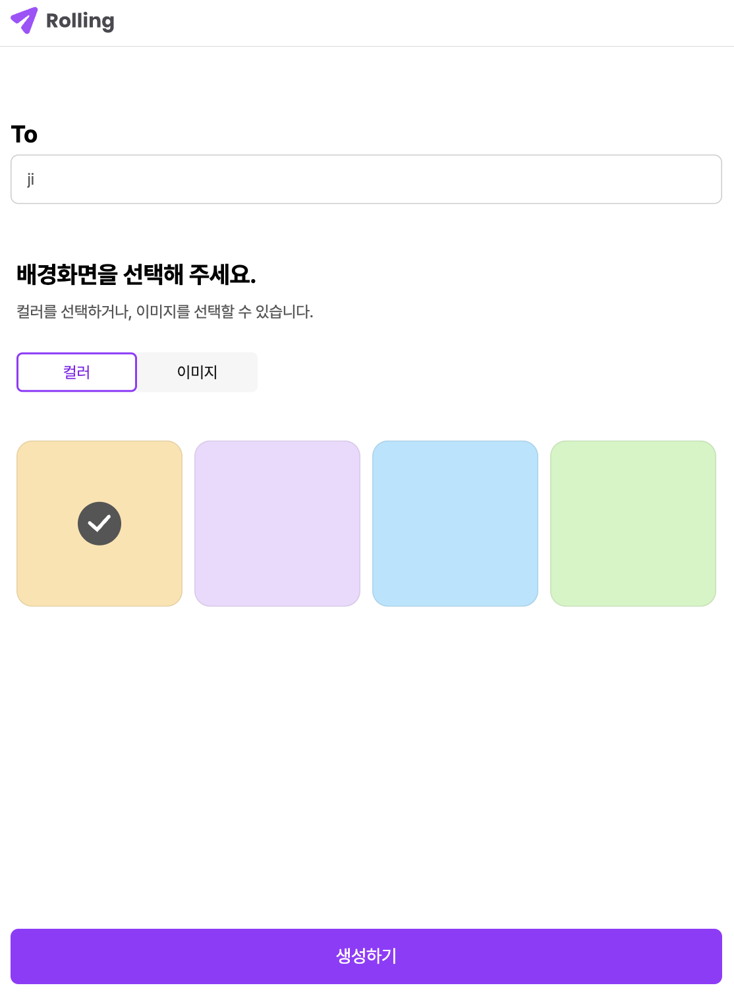 |
| ----------------------------------------    | ------------------------------------- |

| 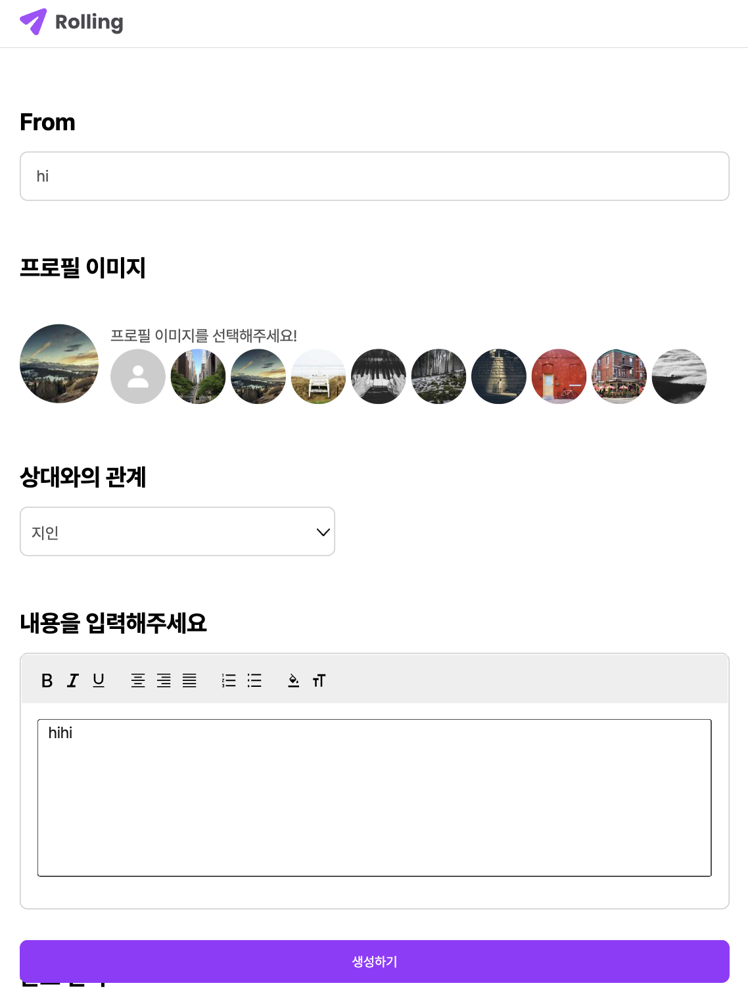 |  |
| ------------------------------------------- | ------------------------------------- |

| 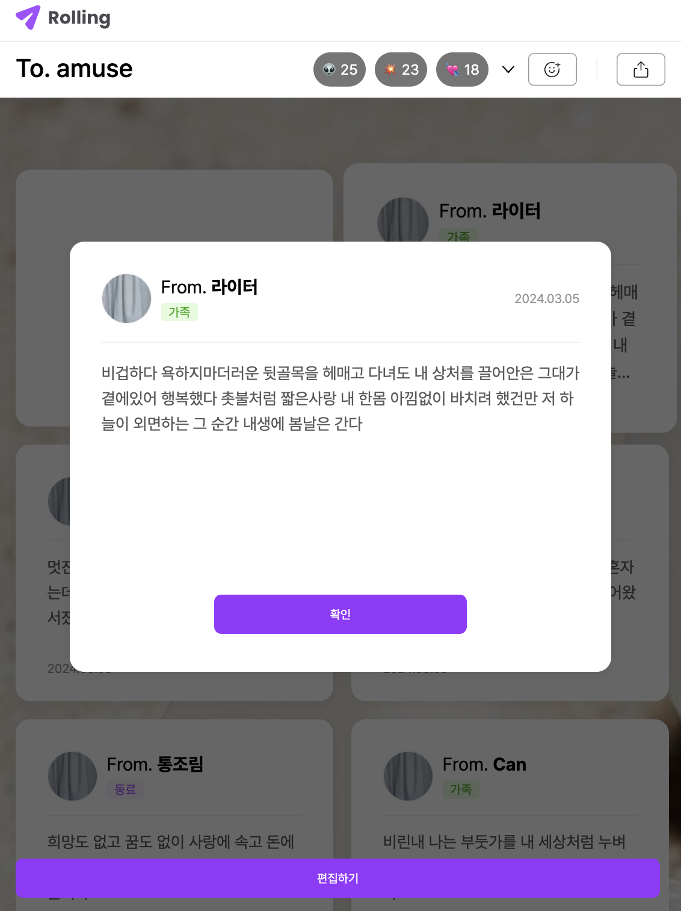 | 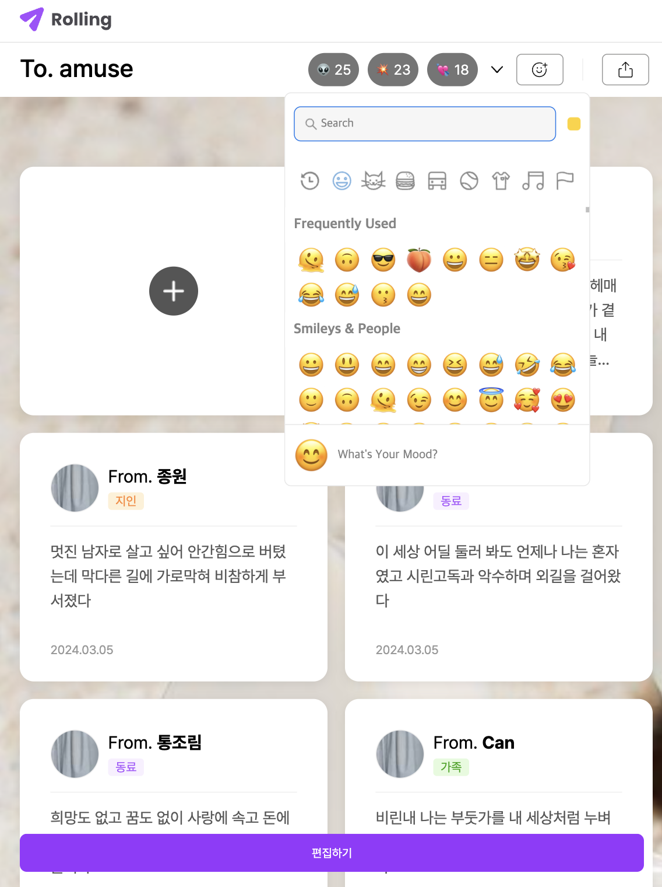 |
| --------------------------------------- | --------------------------------------- |

### 반응형 (Mobile)

| 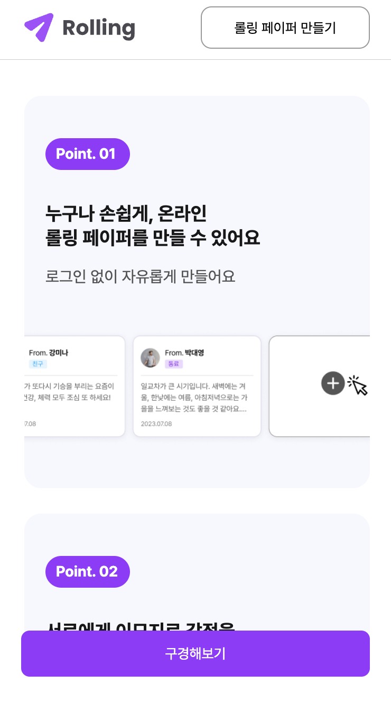 | 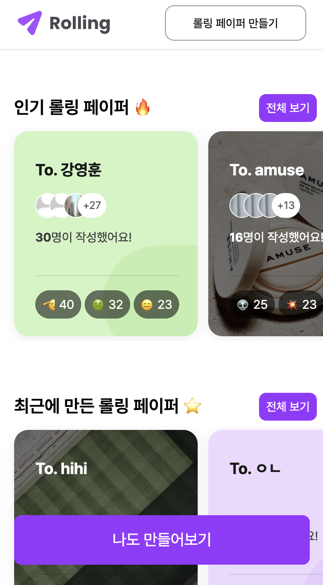 | 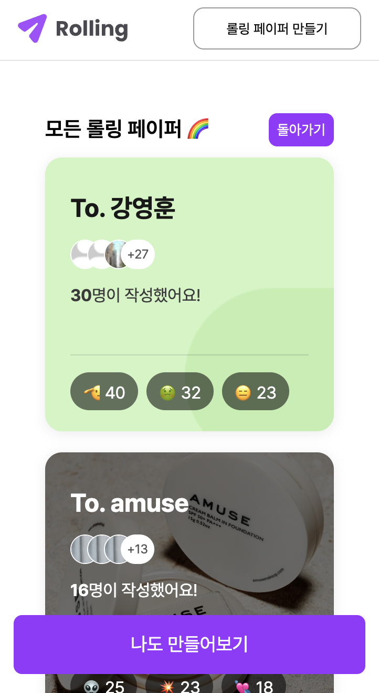 |
| ------------------------------------------- | ------------------------------------- | --------------------------------------- |

| 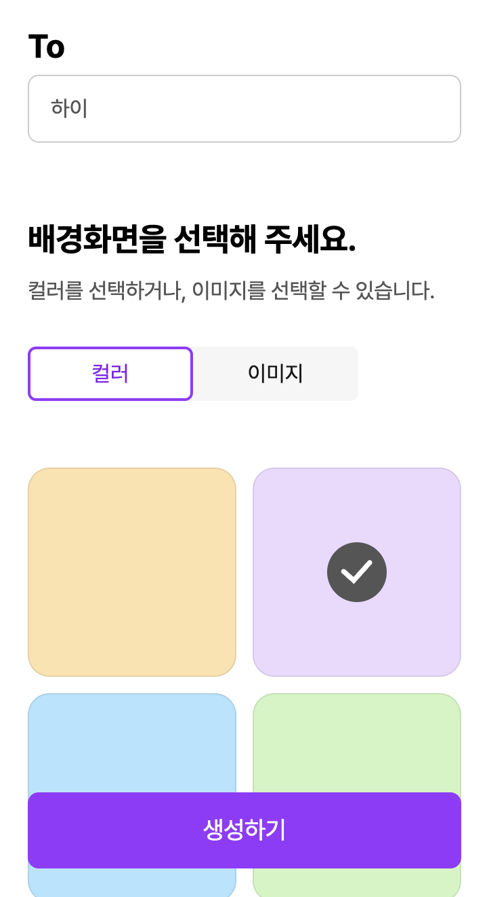 | 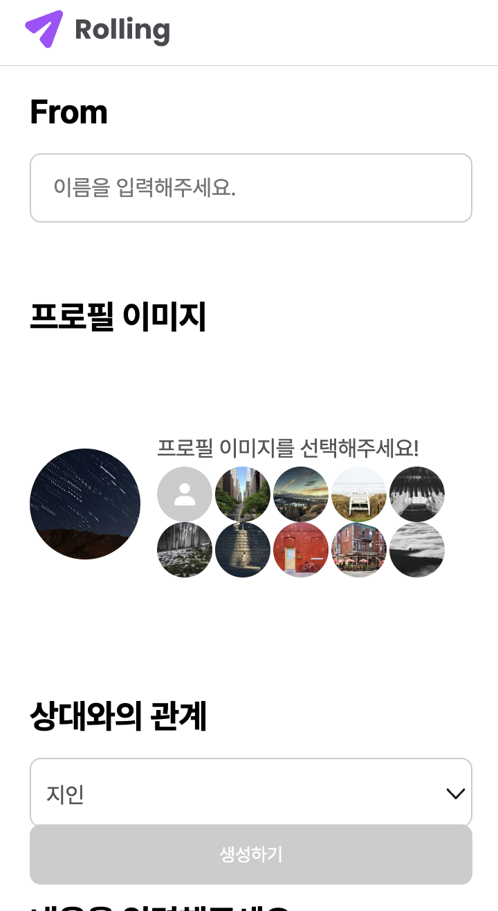 | 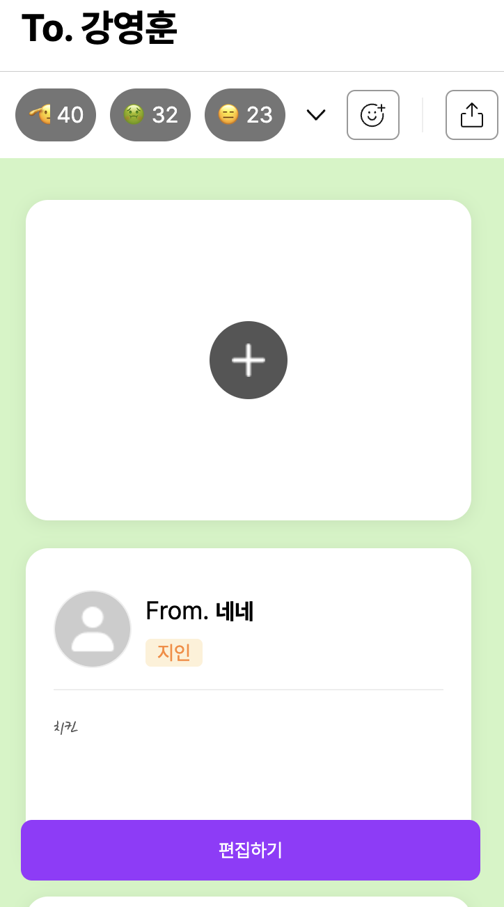 |
| ------------------------------------- | ------------------------------------------- | ------------------------------------- |

| 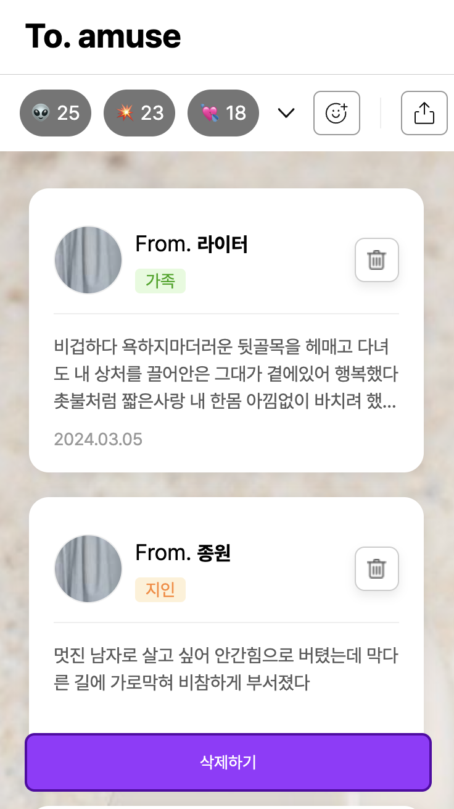 | 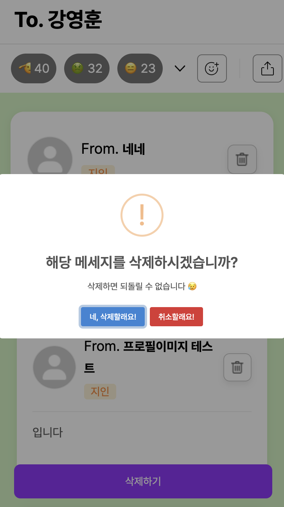 | 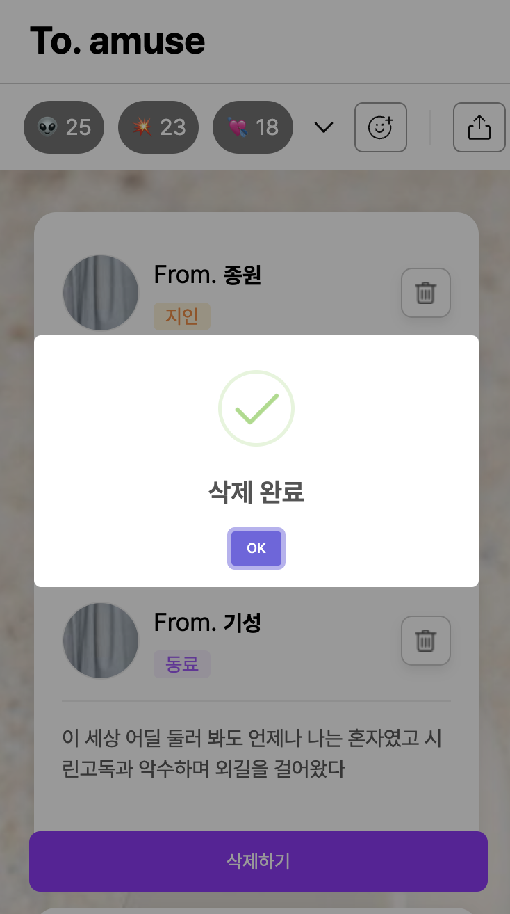 |
| -------------------------------------------------- | ----------------------------------------- | ---------------------------------------------------- |

 

## 🌍 INSTALLING

Instaling

- axios, emoji-picker, react-dom, react query
- react-responsive, styled-components, sweetalert2

  

## 🌍 팀 소개

|                                      FE                                      |                                      FE                                      |                                      FE                                       |
| :--------------------------------------------------------------------------: | :--------------------------------------------------------------------------: | :---------------------------------------------------------------------------: |
|        [문지혜(팀장)](https://github.com/mun-jihye/rolling-paper-app)        |                     [박유빈](https://github.com/yb3143)                      |                      [권민서](https://github.com/min3eo)                      |
|  |  |  |

|                                      FE                                       |                                      FE                                       |
| :---------------------------------------------------------------------------: | :---------------------------------------------------------------------------: |
|                    [김창민](https://github.com/jinwooseok)                    |                   [진찬용](https://github.com/Jin-Chanyong)                   |
|  |  |
